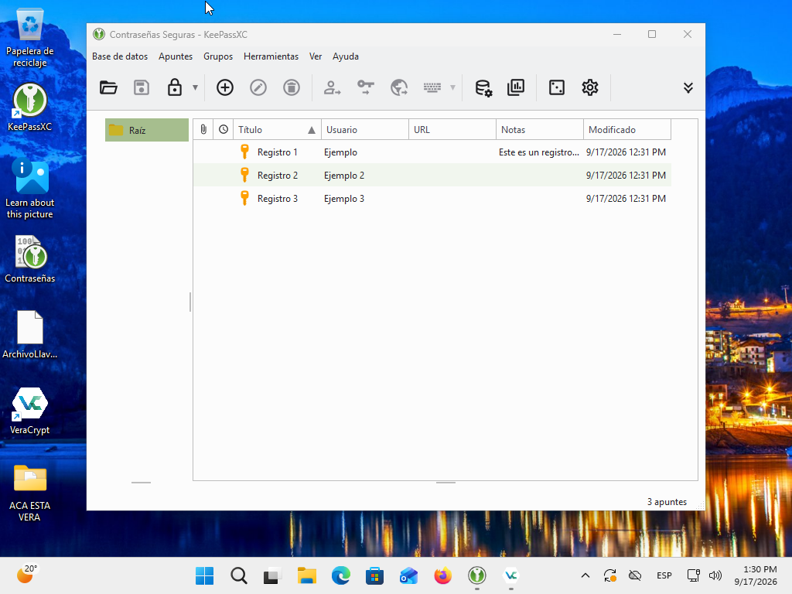
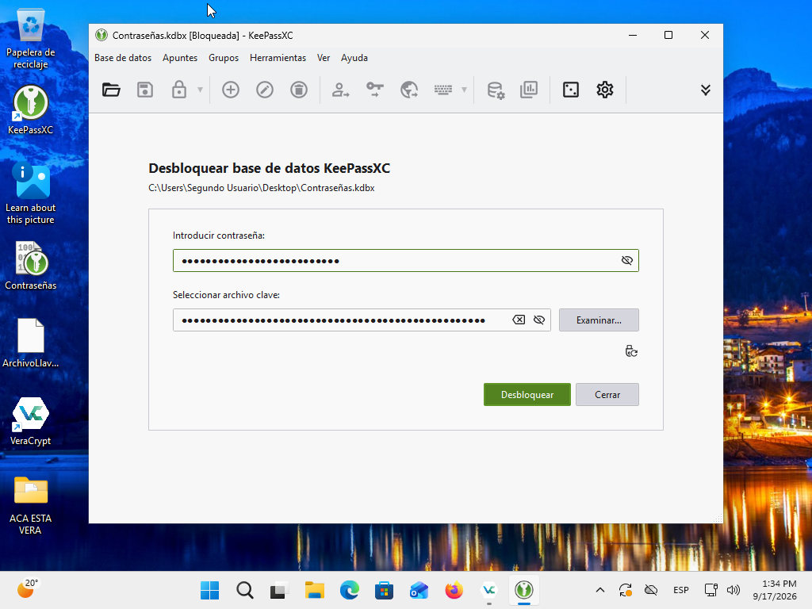
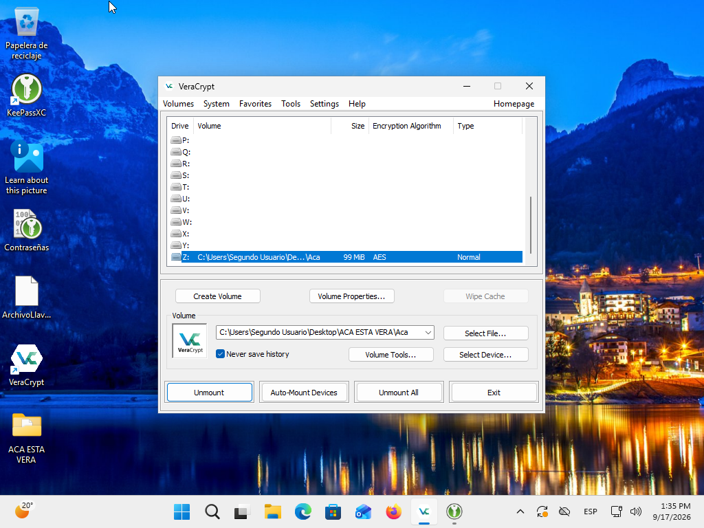
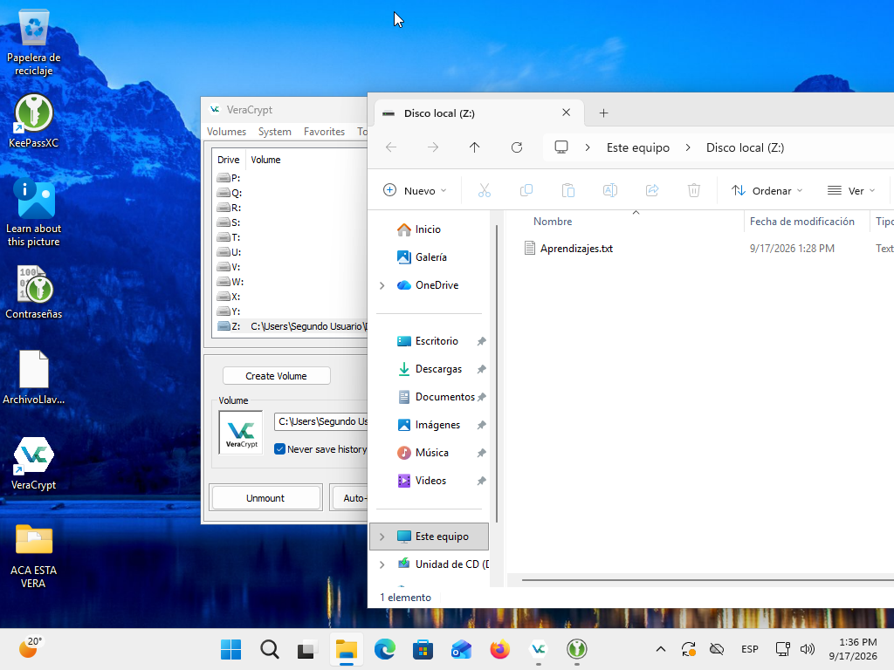

# Práctica de Seguridad

## 1. Bóveda de contraseñas en KeePassXC

En esta captura se muestra la bóveda de KeePassXC con los registros almacenados.

## 2. Contraseña y Key File

En esta captura se muestra la pantalla de desbloqueo de KeePassXC, donde se solicita la contraseña y el archivo de clave (Key File) para acceder a la bóveda.

## 3. Volumen cifrado con VeraCrypt

En esta captura se muestra un volumen montado en VeraCrypt utilizando el algoritmo de cifrado AES.

## 4. Archivo dentro del volumen cifrado

En esta captura se muestra el contenido del volumen cifrado montado como unidad Z:, donde se encuentra almacenado un archivo de texto.

